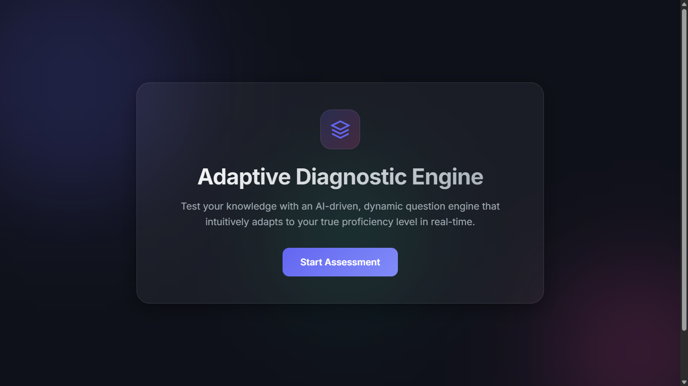
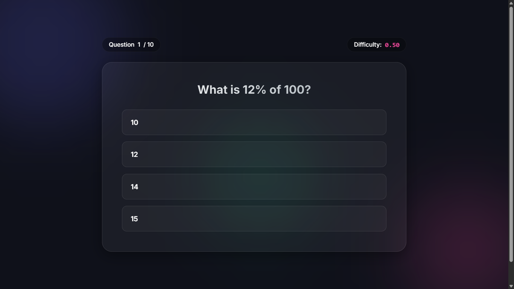
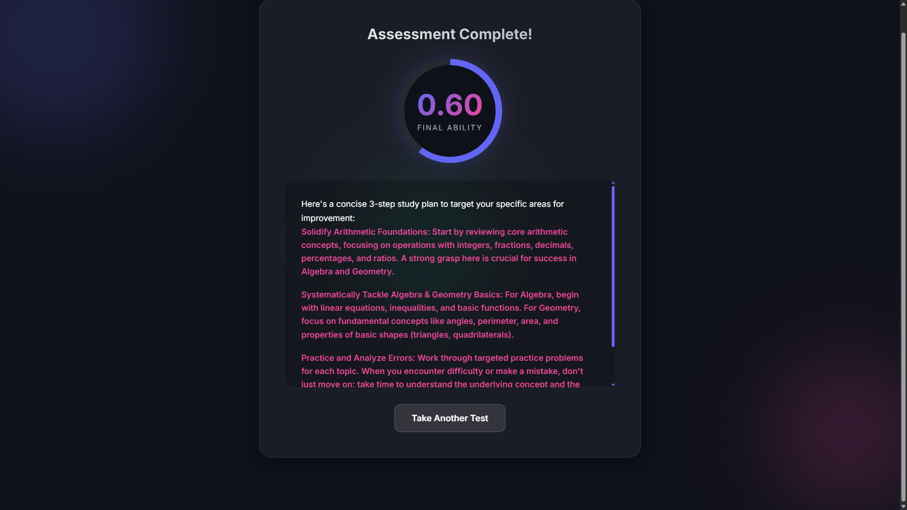

# AI-Driven Adaptive Diagnostic Engine

A lightweight 1-Dimensional Adaptive Testing Prototype built directly to dynamically select questions to gauge a student's proficiency level based on their previous answers.

## Screenshots





---

## Setup Instructions

1. Clone the repository
2. Set up a Python virtual environment:
   ```bash
   python -m venv venv
   source venv/bin/activate  # On Windows: venv\Scripts\activate
   ```
3. Install dependencies:
   ```bash
   pip install -r requirements.txt
   ```
4. Set up environment variables locally in a `.env` file at the root. You need:
   ```env
   MONGO_URI=mongodb+srv://<user>:<password>@<cluster>.mongodb.net/?appName=<AppName>
   DB_NAME=adaptive_engine
   OPENAI_API_KEY=your_openai_api_key_here
   ```
5. Seed the database with the initial questions:
   ```bash
   python seed_questions.py
   ```
6. Run the FastAPI application:
   ```bash
   uvicorn app.main:app --reload
   ```
   _The API will be available at `http://127.0.0.1:8000/docs` (Swagger UI)._

## API Documentation

- `POST /start-session`: Initializes a new testing session with a baseline ability score of 0.5.
- `GET /next-question/{session_id}`: Retrieves the next question tailored to the student's current ability score. Stops returning questions after 10 questions have been answered.
- `POST /submit-answer`: Submits an answer for the current question, updates the `ability_score` using IRT logic, and records the answer logic.
  - Body: `{"session_id": "string", "question_id": "string", "answer": "string"}`
- `GET /study-plan/{session_id}`: If the session has been completed (10 questions), this endpoint sends the missed topics to an LLM to generate a custom 3-step study plan based on their ability level.

## Adaptive Algorithm Logic

The application implements a rudimentary 1D Item Response Theory (IRT) model to estimate a student's ability.

1. **Starting Point:** Every session starts with an estimated `ability_score` of 0.5 (Scale 0.1 to 1.0).
2. **Next Question Selection:** The engine looks for an unasked question with a `difficulty` closest to the user's current `ability_score`.
3. **Refinement:** After receiving a correct (1) or incorrect (0) answer, the probability of getting the question correct is predicted using the logistic curve: `P = 1 / (1 + exp(difficulty - ability))`.
   The ability is then updated using a simple gradient descent step:
   `new_ability = old_ability + learning_rate * (actual - predicted)`.

